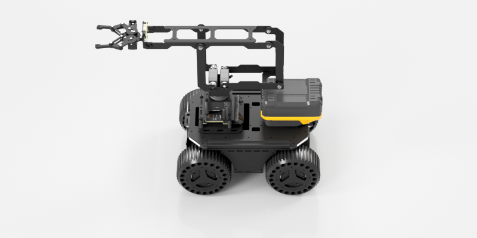

# 配置与中位校准

SDK 从 `arm_config.json` 读取串口、波特率、舵机 ID、中位、方向、限位和机械臂连杆参数。

## LinkArm-M 必改参数

```json
{
  "linkarm": {
    "default_device_serial_ports": "COM7",
    "serial_baudrate": 500000,
    "joint_type": "scs",
    "joint_id": [31, 32, 33, 34],
    "node_id": 40,
    "servo_middle": [513, 508, 327, 632]
  }
}
```

| 字段 | LinkArm-M 设置 |
| --- | --- |
| `default_device_serial_ports` | 当前电脑识别出的串口 |
| `serial_baudrate` | `500000` |
| `joint_type` | `scs` |
| `joint_id` | 默认 `[31, 32, 33, 34]` |
| `node_id` | TTL Node (A) 默认 `40` |
| `servo_middle` | 当前机械臂贴纸上的四个值 |

## 为什么每台机械臂都要填写中位

LinkArm-M 使用的 SCS 总线舵机不能把机械臂应用层的关节中位保存在舵机内部，因此 SDK 使用 `servo_middle` 把舵机反馈值转换为机械臂关节角。

中位错误会导致：

- 关节零度姿态偏移
- FK 计算结果错误
- IK 目标位置不准
- 关节运动方向或幅度异常
- 末端位置偏差和碰撞风险

## 按贴纸填写

假设机身贴纸为：

```text
servo_middle:
[513,508,327,632]
```

配置应写成：

```json
"servo_middle": [
  513,
  508,
  327,
  632
]
```

!!! danger "不要使用示例值代替贴纸值"
    每台机械臂的数据不同。不要复制其他机械臂的配置，也不要默认使用 `[511, 511, 511, 511]`。

修改 JSON 时：

- 使用英文双引号
- 使用英文逗号
- 保留四个数值及顺序
- 不要添加注释
- 保存后先执行 `status`

## 验证零位

LinkArm-M 的正确中位姿态如下图所示。机械臂基本水平展开，夹爪朝向前方：

{ .img-rounded }

机械臂已经固定并清空工作空间后执行：

=== "Windows"

    ```powershell
    python linkarm.py joints 0 0 0 0
    ```

=== "macOS / Linux"

    ```bash
    python3 linkarm.py joints 0 0 0 0
    ```

姿态应与上图的中位参考一致。若明显偏斜，应立即断电并重新核对贴纸数据，不要继续执行 IK 或大幅关节动作。

## 重新记录中位

只有在原贴纸数据丢失、机械结构或舵机更换后，才应重新记录中位。

1. 关闭所有关节扭矩。
2. 用手把机械臂准确摆到机械零位。
3. 记录当前位置到内存。
4. 保存到 `arm_config.json`。

```bash
python linkarm.py torque-off-all
python linkarm.py set-middle
python linkarm.py save-middle
```

!!! danger "重新校准会覆盖原始中位"
    操作前先备份 `arm_config.json`。机械零位不准确会永久影响后续 IK/FK 和关节控制，建议优先恢复机身贴纸数据。

## 其他重要配置

| 字段 | 作用 |
| --- | --- |
| `gripper_torque_limit` | 夹爪最大扭矩限制 |
| `joint_direction` | 关节方向 |
| `joint_limit` | 各关节弧度范围 |
| `link_ab` 等 | 机械臂连杆模型参数 |

除非更换机械结构或明确知道运动学含义，否则不要修改方向、限位和连杆参数。
