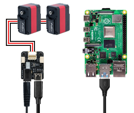

# 安装 USB 串口驱动

{ .img-rounded }

TTL Adapter (A) 使用 CH343 USB 转串口芯片。大多数新系统可以自动识别，但部分 Windows、Linux 或旧系统可能需要手动安装 CH343 / CH34X 驱动。

## 是否需要安装驱动

插入 TTL Adapter (A) 后，如果系统能看到串口设备，通常不需要额外安装驱动。

- Windows：设备管理器中能看到 `COMx`
- Linux：能看到 `/dev/ttyUSB0` 或 `/dev/ttyACM0`
- MacOS：能看到 `/dev/tty.usbserial-xxxx`

如果没有出现串口，或设备管理器中有黄色感叹号，则需要安装驱动。

## Windows

1. 插入 TTL Adapter (A)。
2. 打开设备管理器。
3. 查看“端口（COM 和 LPT）”或“其他设备”。
4. 如果出现未知设备，安装 CH343 / CH34X 驱动。
5. 重新插拔设备。

## Linux

Linux 通常可直接识别。如果无法识别，请先确认：

```bash
lsusb
ls /dev/ttyUSB* /dev/ttyACM* 2>/dev/null
```

如果能看到设备但无法访问端口，请先处理权限问题：

```bash
sudo usermod -aG dialout $USER
```

然后注销并重新登录。

## MacOS

MacOS 一般可以识别常见 USB 串口设备。如果无法识别，可检查：

```bash
ls /dev/tty.usb* /dev/cu.usb* 2>/dev/null
```

## 仍然无法识别

请按顺序检查：

1. USB 线是否支持数据传输。
2. 是否更换过 USB 口测试。
3. 是否有其它串口程序占用端口。
4. 是否在虚拟机中，需要把 USB 设备映射到虚拟机。
5. 是否使用了质量较差的 USB Hub。
