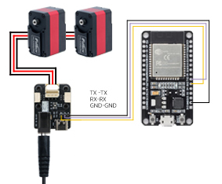
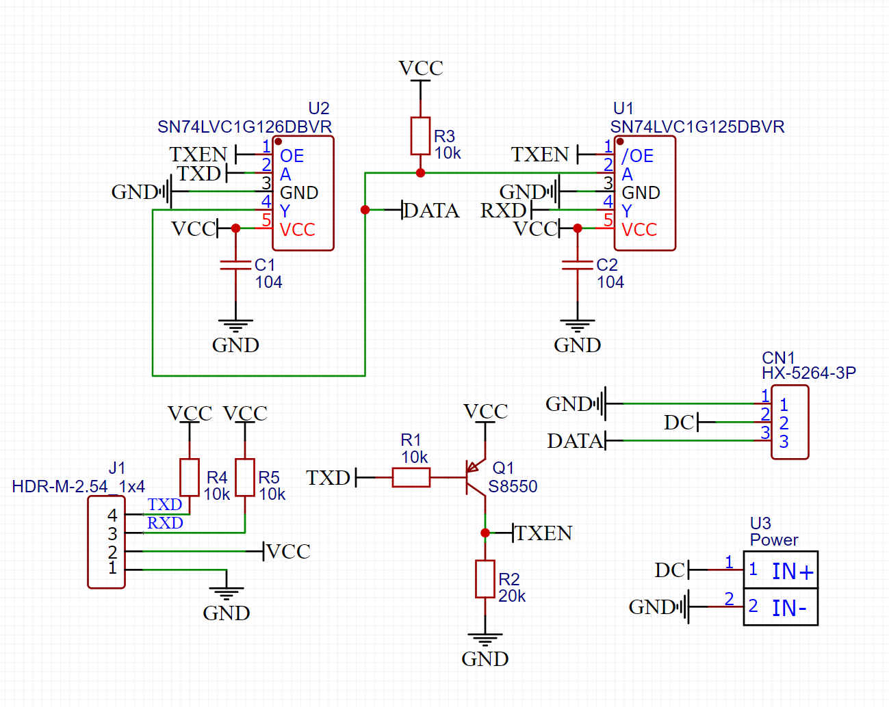

# MCU UART 接线基础

本文说明 MCU 使用 C++ / Arduino SDK 控制 Lygion TTL 总线设备时的基础接线方式。

## 1. 两种常见方案

### 方案 A：MCU 接 TTL Adapter (A)

!!! note "适用场景"
      该方案适用于绝大部分用户使用。

{ .img-rounded }

```text
MCU UART
   │ RX / TX / GND
   ▼
TTL Adapter (A)
   │ TTL Bus
   ▼
TTL Bus Device
```

#### MCU 接 TTL Adapter (A) 的接线

| MCU | TTL Adapter (A) |
| --- | --- |
| RX | RX |
| TX | TX |
| GND | GND |

!!! note "与普通 USB-TTL 模块不同"
    TTL Adapter (A) 的 UART 引脚连接到板载单线 TTL 转换电路，因此外部 MCU 接入时通常使用 `RX 接 RX`、`TX 接 TX`。

    如果你使用的是普通 USB-TTL 模块或自定义电路，接线方式可能不同，需要按电路设计确认。

#### 电平要求

TTL Adapter (A) 的 UART 通信电平为：

```text
3.3V TTL
```

常见情况：

| MCU | 是否通常兼容 |
| --- | --- |
| ESP32 / ESP32S3 | 兼容 3.3V |
| STM32 | 通常兼容 |
| Arduino Mega2560 | IO 为 5V，需要使用电平转换 |

!!! warning "不要直接把不兼容的 5V UART 接入 3.3V 输入"
    如果 MCU TX 输出 5V，而对方输入不耐受 5V，可能损坏芯片。必要时请使用电平转换电路。

### 方案 B：MCU 接自定义 UART 转单线 TTL 电路

!!! note "适用场景"
      该方案适用于有高集成度需求的用户使用。

{ .img-rounded }

```text
MCU UART (TXD RXD VCC-串口电平 GND)
   │
   ▼
UART 转单线 TTL 电路
   │
   ▼
TTL Bus Device (DATA)
```

## 2. 代码中的串口配置

### ESP32S3 示例

```cpp
Serial1.begin(1000000, SERIAL_8N1, 18, 17); // 总线设备通信
ttlsd.pSerial = &Serial1;
```

其中：

| 参数 | 含义 |
| --- | --- |
| `1000000` | TTL 总线波特率，默认 1 Mbps |
| `18` | ESP32S3 RX 引脚 |
| `17` | ESP32S3 TX 引脚 |

### Mega2560 示例

```cpp
Serial1.begin(1000000); // 总线设备通信
ttlsd.pSerial = &Serial1;
```

Mega2560 的 `Serial1` 通常对应：

```text
RX1 = 19
TX1 = 18
```

## 3. 总线设备接线

TTL 总线常见三根线：

```text
+   电源正极
-   电源负极 / GND
S   单线 TTL 信号
```

请确认：

- `+` 不要接到 `-`。
- `S` 不要接到电源。
- 所有设备 GND 必须共地。
- 执行器类设备需要外部电源。

## 4. 第一次接线建议

1. 只连接一个 TTL 总线设备。
2. 先运行读取类 Demo。
3. 确认能读取数据后，再连接执行器负载。
4. 多设备接入前，先分别修改每个设备 ID。

## 5. 常见问题

### Q1：为什么串口监视器有输出，但读不到设备？

USB 调试串口正常，不代表 TTL 总线串口正常。请检查：

- `ttlsd.pSerial = &Serial1;` 是否设置正确。
- RX / TX 引脚号是否与你实际接线一致。
- TTL 总线设备 ID 和波特率是否正确。
- GND 是否共地。

### Q2：可以用软件串口吗？

不推荐。

Lygion TTL 总线设备默认波特率为 1 Mbps，软件串口在高速通信下稳定性较差。建议使用硬件 UART。
