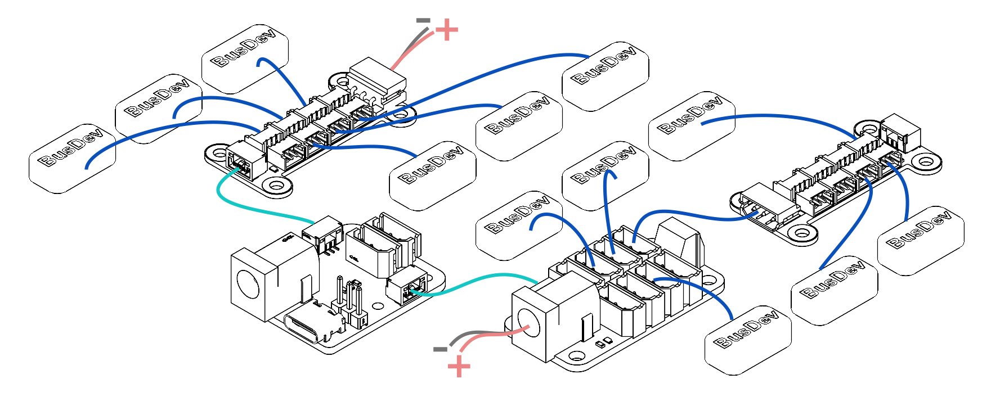

# 总线设备分组供电与供电解耦

本教程介绍如何在 Lygion TTL 总线系统中使用 **TTL-5264 8P Hub (A)** 和 **HC-1.25 8P Hub (A)** 等 Hub 产品对多个总线设备进行分组供电、分组布线和供电解耦。

当一个项目中需要同时连接多个 TTL 总线舵机、关节模组、轮毂电机、编码器或驱动板时，不建议把所有设备简单串接在一根长线上。更合理的做法是：**通信总线共用，供电按负载和电压分组**。

---

## 1. 什么时候需要分组供电？

如果你的项目符合下面任意一种情况，建议使用分线板进行分组供电：

- 同一套系统中有多个 TTL 总线设备。
- 不同设备需要不同供电电压，例如一组舵机使用 12V，另一组步进电机或执行器使用 24V。
- 某些设备电流较大，启动或堵转时会导致总线电压波动。
- 机械臂、多足机器人、移动底盘等项目中线缆较多，需要更清晰的布线结构。
- 希望减少某一组设备电源波动对其它设备的影响。

!!! tip "核心原则"
    TTL 总线设备可以共用同一条通信信号线，但供电不一定必须全部来自同一个电源。

    对于多设备系统，建议根据设备类型、工作电压、电流大小和机械分区进行供电分组。

---

## 2. 什么是供电解耦？

{ .img-rounded }

在 TTL 总线系统中，常见的 3Pin 接口通常包含：

```text
+     电源正极
-     电源负极 / GND
S     TTL 总线信号
```

如果多个设备全部通过同一根 3Pin 总线线缆串联，电源和信号会沿着同一路径传递。这样虽然简单，但在设备数量多、电流大、线缆较长时，可能出现以下问题：

- 远端设备电压降低。
- 电机启动瞬间造成电压跌落。
- 大电流设备影响低功耗传感器或编码器。
- 某一组执行器异常时影响整条总线。
- 线缆发热或接插件电流压力过大。

**供电解耦**的目的，就是让通信信号可以继续共用总线，而不同设备组的供电可以由不同电源或不同供电入口提供。

```text
通信：仍然是一条 TTL 总线
供电：可以按设备组分别接入
```

!!! warning "GND 必须保持共地"
    即使不同设备组使用不同电源，也必须保证各组电源的 GND 与控制器 GND 共地。

    如果没有共地，TTL 信号没有统一参考电位，可能导致通信失败、误码，甚至损坏设备。

---

## 3. Lygion Hub 产品

Lygion 提供常用的 TTL 总线分线板：

| 产品 | 适用接口 | 典型用途 |
| --- | --- | --- |
| [TTL-5264 8P Hub (A)](../reference/bus-devices/hub-boards/ttl-5264-8p-hub-a.md) | 5264-3P / 5521 DC / KF301-2P / GH-1.25-3P | 适合 5264-3P 接口的 TTL 步进电机驱动板和总线舵机，多板级联和不同电压分组供电 |
| [HC-1.25 8P Hub (A)](../reference/bus-devices/hub-boards/hc-1.25-8p-hub-a.md) | HC-1.25-3P / HX-5264-3P / GH-1.25-3P | 适合 HC-1.25-3P 接口的小型总线设备，便于轻量化布线 |

两者的设计目标类似，都是把一条 TTL 总线扩展成多个接口，方便多设备连接。但它们的接口形态和适用设备不同。

---

## 4. TTL-5264 8P Hub (A)

### 4.1 产品定位

**TTL-5264 8P Hub (A)** 是一款面向 5264-3P 接口 TTL 总线设备的分线板，适合用于 Lygion 步进电机驱动板飞特总线舵机等其它 TTL 总线设备。

它可以将一个 TTL 总线接口扩展为多个 5264-3P 接口，也可以通过板间通信接口实现多块分线板级联，从而为多组设备提供更清晰的供电和布线结构。

### 4.2 主要特点

- 支持 5264-3P TTL 总线接口。
- 板载 8 个 5264-3P 设备接口。
- 支持 DC5521 供电接口。
- 支持 KF301-2P 接线端子供电。
- 支持板间通信接口，便于多块 Hub 级联。
- 支持为不同分组接入不同电压的电源。
- 板载电源指示灯。
- 体积约 `44 × 21 × 14 mm`，适合安装在机械臂、多足机器人、舵机阵列等空间有限的结构中。

### 4.3 接口说明

| 编号 | 接口 / 资源 | 说明 |
| --- | --- | --- |
| 1 | KF301-2P 供电端子 | 与 DC5521 供电接口连接，任意一个供电入口接入即可 |
| 2 | 电源指示灯 | 用于显示当前分线板是否接入电源 |
| 3 | 安装孔 | 约 3 mm 直径，4 个安装孔 |
| 4 | DC5521 供电接口 | 支持 DC 5–25.2V 供电 |
| 5 | 单线 TTL 板间通信接口 | 用于多块分线板之间传递 TTL 通信信号 |
| 6 | 5264-3P 接口 ×8 | 用于连接 5264-3P 接口的 TTL 总线设备 |

!!! note "供电电压必须匹配设备"
    Hub 本身只是分线与供电分配板，不会自动升压、降压或稳压。

    接入 Hub 的电源电压必须与连接的总线舵机、关节、轮毂电机或其它设备的额定电压匹配。

---

## 5. HC-1.25 8P Hub (A)

### 5.1 产品定位

**HC-1.25 8P Hub (A)** 是一款面向 HC-1.25-3P 接口 TTL 总线设备的分线板，适合空间敏感的小型机器人、灵巧手、多足机器人以及小型模块化项目。

它可以把一个 TTL 总线接口扩展为 8 个 HC-1.25-3P 接口，使多个小型总线设备可以更整洁地连接到同一条总线上。

### 5.2 主要特点

- 支持 HC-1.25-3P TTL 总线设备。
- 板载 8 个 HC-1.25-3P 接口。
- 支持 HX-5264-3P 接口，可直接连接 TTL Adapter (A) 或带 5264-3P 总线接口的控制器。
- 支持 GH-1.25-3P 通信接口，可用于通信级联或通信解耦。
- 板载供电指示灯。
- 体积约 `39 × 21 mm`，适合安装在空间紧凑的机器人结构中。
- 安装孔约 2.6 mm，4 个安装孔。

### 5.3 接口说明

| 编号 | 接口 / 资源 | 说明 |
| --- | --- | --- |
| 1 | HX-5264-3P | 可直接与 TTL Adapter (A) 或带 5264-3P 接口的控制器连接，用于通信和供电 |
| 2 | HC-1.25-3P 接口 ×8 | 用于连接 HC-1.25-3P 接口的 TTL 总线设备 |
| 3 | 供电指示灯 | 用于显示当前分线板是否接入电源 |
| 4 | GH-1.25-3P | 可用于连接 TTL Adapter (A) 或其它 Hub，仅用于通信，不用于供电 |
| 5 | 安装孔 | 约 2.6 mm 直径，4 个安装孔 |

!!! warning "GH-1.25-3P 接口仅用于通信"
    HC-1.25 8P Hub (A) 上的 GH-1.25-3P 接口主要用于 TTL 通信连接，不建议作为供电入口。

    如果需要为该 Hub 上的设备供电，应使用支持供电的 3Pin 总线接口或明确的供电入口。

---

## 6. 基本接线思路

### 6.1 单组设备供电

这是最简单的连接方式，适合设备数量较少、所有设备电压相同、电流不大的项目。

```text
Controller / TTL Adapter (A)
        │ HX-5264-3P
        ▼
     Hub Boards
        │
        ├── TTL Device 1
        ├── TTL Device 2
        ├── TTL Device 3
        └── TTL Device 4
```

此时 Hub 上所有设备通常共用同一个电源。

适合：

- 少量 TTL 编码器。
- 少量低功耗总线设备。
- 小型测试平台。
- 第一次验证通信功能。

---

### 6.2 多组设备使用不同电压供电

当不同设备组需要不同电压时，可以使用多个 Hub 分组供电，并让它们共享 TTL 通信信号。

例如：

```text
TTL Adapter (A)
        │ GH1.25-3P (TTL Signal / GND)
        │
        ├──── Hub A (12V Power) ── TTL Devices Group A
        │
        └──── Hub B (24V Power)  ── TTL Devices Group B
```

适合：

- 一组设备使用 12V，另一组设备使用 24V。
- 机械臂中不同关节使用不同电压等级。
- 移动底盘中低功耗设备和大功率执行器分开供电。
- 测试平台中需要对不同设备组独立上电。

!!! warning "不同电压设备不要混接供电"
    如果一块 Hub 上的所有 `+` 电源引脚是连通的，那么该 Hub 上连接的设备应使用同一电压等级。

    不要把 12V 设备和 24V 设备接在同一个未做电源隔离的供电组上。

---

### 6.3 通信级联，供电分组

有些情况下，你只希望多个 Hub 共用通信，而不希望电源互相传递。此时可以使用只传递通信信号的板间接口，或只连接 TTL 信号和 GND，不连接电源正极。

```text
Controller
   │
   ▼
Hub A  ← 独立电源 A
   │
   ├── Device A1
   └── Device A2

Hub B  ← 独立电源 B
   │
   ├── Device B1
   └── Device B2

Hub A 与 Hub B 之间：
S 信号相连
GND 相连
+ 电源正极不互接
```

这种方式就是常见的供电解耦（等效于使用 GH1.25-3P 板间通信接口进行连接）。

适合：

- 多块 Hub 级联。
- 多组不同电压设备。
- 希望降低大电流设备对其它设备的影响。
- 希望某一组设备可以单独断电维护。

---

## 7. 推荐接线方案

### 7.1 使用 TTL-5264 8P Hub (A) 给 5264-3P 设备分组供电

典型结构：

```text
PC / MCU / TTL Adapter (A) ← Power
        │ HX-5264-3P
        ▼
TTL-5264 8P Hub (A)
        │
        ├── 5264-3P TTL Device 1
        ├── 5264-3P TTL Device 2
        ├── 5264-3P TTL Device 3
        └── 5264-3P TTL Device 4
```

如果设备较多，可以使用多块 Hub：

```text
TTL Adapter (A)
        │ GH1.25-3P
        ├── TTL-5264 Hub A  ← Power A
        │       ├── Device A1
        │       └── Device A2
        │
        └── TTL-5264 Hub B  ← Power B
                ├── Device B1
                └── Device B2
```

注意事项：

- 每一组 Hub 的供电电压必须匹配该组设备。
- 大电流设备建议单独分组。
- 同一条 TTL 总线上的设备 ID 不能重复。
- 多块 Hub 级联时，应确认通信信号和 GND 已经连接。

---

### 7.2 使用 HC-1.25 8P Hub (A) 给 HC-1.25-3P 设备分线

典型结构：

```text
TTL Adapter (A) ← Power
        │ 5264-3P
        ▼
HC-1.25 8P Hub (A)
        │
        ├── HC-1.25-3P TTL Device 1
        ├── HC-1.25-3P TTL Device 2
        ├── HC-1.25-3P TTL Device 3
        └── HC-1.25-3P TTL Device 4
```

如果需要让通信和供电分开，可以使用 GH-1.25-3P 接口只传递通信，再从合适的供电接口给设备组供电。

```text
TTL Adapter (A)
        │ GH1.25-3P
        ▼
HC-1.25 8P Hub (A) ← Power
        │
        ├── HC-1.25-3P TTL Device 1
        ├── HC-1.25-3P TTL Device 2
        ├── HC-1.25-3P TTL Device 3
        └── HC-1.25-3P TTL Device 4
```

适合：

- 多个小型 TTL 编码器。
- 多个小型总线舵机。
- 灵巧手、多足机器人、轻量级机械结构。
- 空间有限且需要整洁布线的项目。

---

## 8. 上电前检查清单

上电前请逐项检查：

- 电源电压是否符合设备规格。
- 电源正负极是否接反。
- `+ / - / S` 顺序是否正确。
- 不同电压设备是否已经分组。
- 不同电源的 GND 是否共地。
- 同一条 TTL 总线上的设备 ID 是否唯一。
- 电源电流能力是否足够。
- 线缆和接插件是否能承受实际工作电流。
- 执行器附近是否有易碎品、线缆或其它障碍物。

!!! danger "不要带电插拔大电流设备"
    对于舵机、电机、步进驱动器、轮毂电机等执行器，不建议在设备运行或电源已接入时频繁插拔。

    带电插拔可能产生冲击电流、电弧或接触不良，严重时可能损坏接口或设备。

---

## 9. 常见问题

### Q1：所有设备都接在同一个 Hub 上可以吗？

如果所有设备电压相同、总电流不大、线缆较短，可以接在同一个 Hub 上。

如果设备数量较多，或者有大电流执行器，建议分成多个供电组。

### Q2：不同电源供电时，GND 需要连接在一起吗？

需要。

TTL 信号必须有共同参考地。不同电源供电时，应将各组电源的 GND 与控制器 GND 连接在一起。

### Q3：只把 S 信号接起来，不接 GND 可以通信吗？

不建议，也通常不稳定。

TTL 信号需要以 GND 作为参考。如果没有共地，可能出现通信失败、误码或设备异常。

### Q4：使用多个 Hub 时，设备 ID 可以重复吗？

不可以。

只要设备连接在同一条 TTL 通信总线上，所有设备 ID 都必须唯一。即使设备分布在不同 Hub 上，也不能使用重复 ID。

更多说明请参考：[设备 ID 与波特率](device-id-and-baudrate.md)。

### Q5：为什么大电流设备建议单独分组？

大电流设备启动、急停、堵转或快速加减速时，可能造成电源电压波动和线缆压降。

如果它们和传感器、编码器或控制器共用过长供电路径，可能导致通信不稳定或低功耗设备复位。

---

## 10. 相关基础教程

- [设备 ID 与波特率](device-id-and-baudrate.md)
- [供电与接线基础](power-and-wiring-basics.md)
- [常见通信问题排查](communication-troubleshooting.md)
- [FD 调试软件](fd-tool.md)
